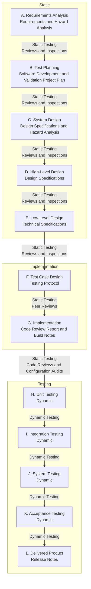

```mermaid
graph TD;
  A[A. Requirements Analysis\nRequirements and Hazard Analysis] -->|Static Testing\nReviews and Inspections| B[B. Test Planning\nSoftware Development and Validation Project Plan]
  B -->|Static Testing\nReviews and Inspections| C[C. System Design\nDesign Specifications and Hazard Analysis]
  C -->|Static Testing\nReviews and Inspections| D[D. High-Level Design\nDesign Specifications]
  D -->|Static Testing\nReviews and Inspections| E[E. Low-Level Design\nTechnical Specifications]
  E -->|Static Testing\nReviews and Inspections| F[F. Test Case Design\nTesting Protocol]
  F -->|Static Testing\nPeer Reviews| G[G. Implementation\nCode Review Report and Build Notes]
  G -->|Static Testing\nCode Reviews and Configuration Audits| H[H. Unit Testing\nDynamic]
  H -->|Dynamic Testing| I[I. Integration Testing\nDynamic]
  I -->|Dynamic Testing| J[J. System Testing\nDynamic]
  J -->|Dynamic Testing| K[K. Acceptance Testing\nDynamic]
  K -->|Dynamic Testing| L[L. Delivered Product\nRelease Notes]

  subgraph Static
    direction TB
    A
    B
    C
    D
    E
  end

  subgraph Implementation
    direction TB
    F
    G
  end

  subgraph Testing
    direction BT
    L
    K
    J
    I
    H
  end

```
