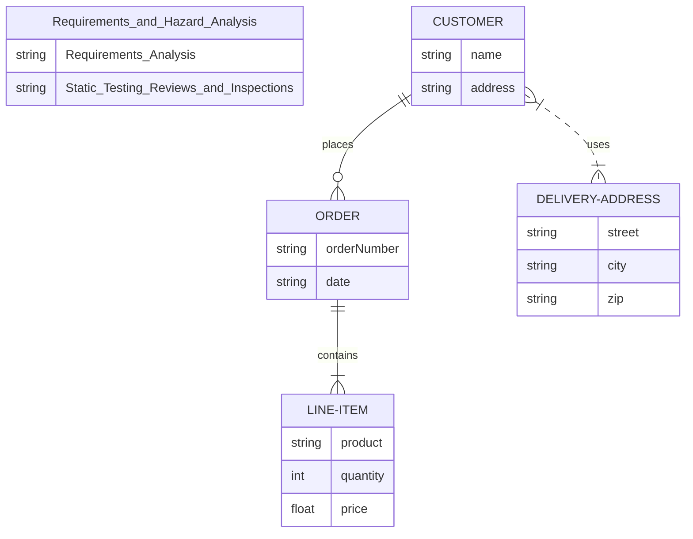

```mermaid
erDiagram
    Requirements_and_Hazard_Analysis {
        string Requirements_Analysis
        string Static_Testing_Reviews_and_Inspections
    }

    CUSTOMER {
        string name
        string address
    }

    ORDER {
        string orderNumber
        string date
    }

    LINE-ITEM {
        string product
        int quantity
        float price
    }

    DELIVERY-ADDRESS {
        string street
        string city
        string zip
    }

    CUSTOMER ||--o{ ORDER : places
    CUSTOMER }|..|{ DELIVERY-ADDRESS : uses
    ORDER ||--|{ LINE-ITEM : contains
```
